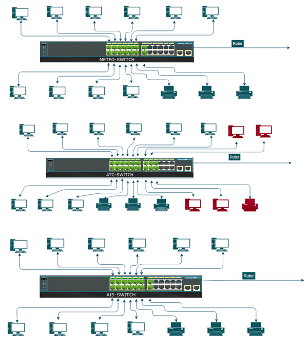
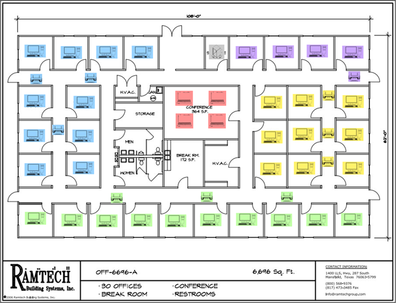
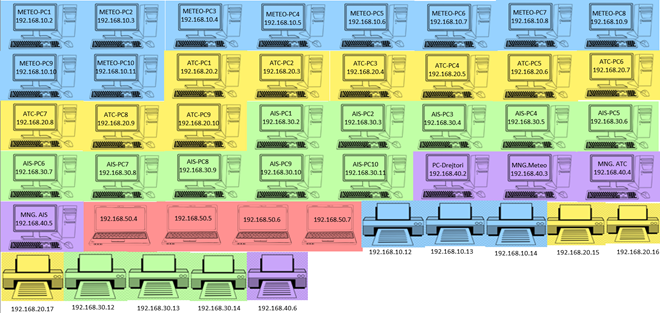
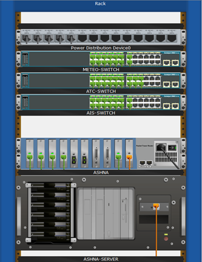

# ANSA Network Implementation Project

### Project Title: Implementation of Computer Network in ANSA

## Project Overview

This project involves the implementation of a computer network for the Air Navigation Services Agency (ANSA). ANSA consists of three departments: Meteorology, Aeronautical Information Service (AIS), and Air Traffic Control (ATC).

## Network Devices Used

- **33 Generic PCs:** Distributed across three departments and management offices.
- **10 Generic Printers:** 3 per department and 1 for management.
- **4 Generic Laptops:** Located in the conference room with wireless connections.
- **3 Cisco Switches (2960-24TT)**
- **1 Cisco Router (Router-PT-empty)**
- **1 Wireless Router (WRT300N)**
- **1 Generic Server:** Connected to the router via Copper Cross-Over cable.

## Network Cabling Details

- **Copper Straight-Through Cables:** Used for connecting all PCs and printers to switches.
- **Copper Cross-Over Cable:** Used for connecting the server to the router.

## Device Locations

- **Meteorology Department:** 10 PCs
- **AIS Department:** 10 PCs
- **ATC Department:** 9 PCs
- **Management Offices:** 4 PCs (3 managers and 1 director)
- **Conference Room:** 4 laptops (wireless connection)

## IP Addressing Scheme

- **Class C IP Addresses:** Each department has its own VLAN. Despite being on different VLANs, devices can communicate with each other through the main router.

## Estimated Cost and Project Duration

- **Estimated Cost:** Approximately 20,000 EUR (including PCs, laptops, and printers)
- **Estimated Duration:** Approximately 15 days with a team of 6 people

## Network Layout and IP Address Scheme

### VLAN Configuration
- **Meteorology:** VLAN 10
- **AIS:** VLAN 30
- **ATC:** VLAN 20
- **Conference Room and Management:** VLAN 40

### IP Addresses
- **Meteorology Department:** 192.168.10.x
- **AIS Department:** 192.168.30.x
- **ATC Department:** 192.168.20.x
- **Management Offices:** 192.168.40.x

---

## Network Topology

The network topology includes detailed layouts and cable connections, ensuring each device is properly connected to switches and routers as per the project plan.

## Rack Cabinet Layout

The rack cabinet layout includes all elements placed accordingly, ensuring an organized and efficient network setup.

---

## Diagrams

### General Network Topology

### Detailed Network Layout

### IP Address Scheme

### Rack Cabinet Layout
